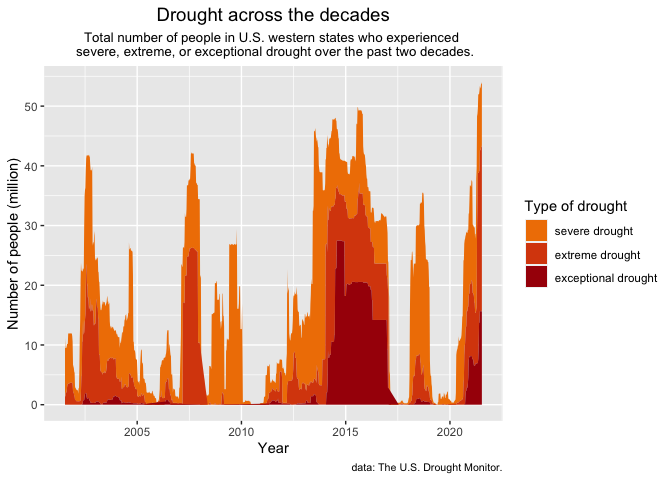

Tidy Tuesday - U.S. drought
================
Amy Mitchell-Whittington
21/07/2021

## U.S. Drought

This week’s data comes from the [U.S. Drought
Monitor](https://droughtmonitor.unl.edu/DmData/DataDownload/ComprehensiveStatistics.aspx).

The dataset details the drought level across U.S. states from 2001-2021.
I wanted to look at the number of people who have experienced severe,
extreme, and/or exceptional drought conditions over this time in the
western states of the U.S.

Data Reference: The U.S. Drought Monitor is jointly produced by the
National Drought Mitigation Center at the University of
Nebraska-Lincoln, the United States Department of Agriculture, and the
National Oceanic and Atmospheric Administration. Map courtesy of NDMC.

<!-- -->
