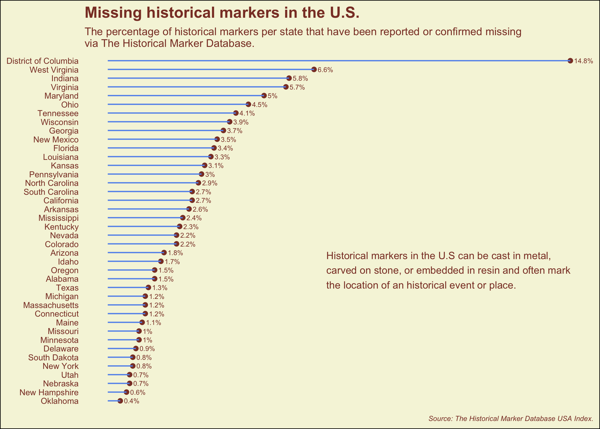

Tidy Tuesday - Historical Markers
================
Amy Mitchell-Whittington
27-06-2023

## Historical Markers in the U.S.

The data this week comes from the [Historical Marker Database USA
Index.](https://www.hmdb.org/geolists.asp?c=United%20States%20of%20America)

<!-- -->
