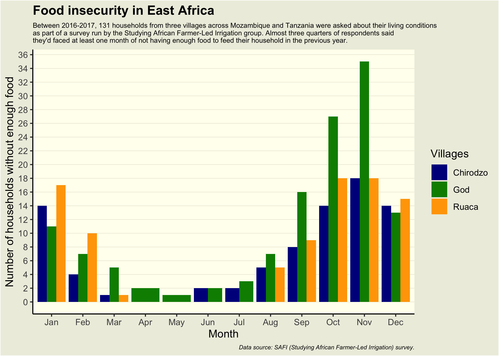

Tidy Tuesday - SAFI Survey
================
Amy Mitchell-Whittington
13-06-2023

## SAFI (Studying African Farmer-Led Irrigation) Survey

The data this week comes from the [SAFI (Studying African Farmer-Led
Irrigation) survey](https://datacarpentry.org/socialsci-workshop/data/),
a subset of the data used in the Data Carpentry Social Sciences
workshop.

<!-- -->
